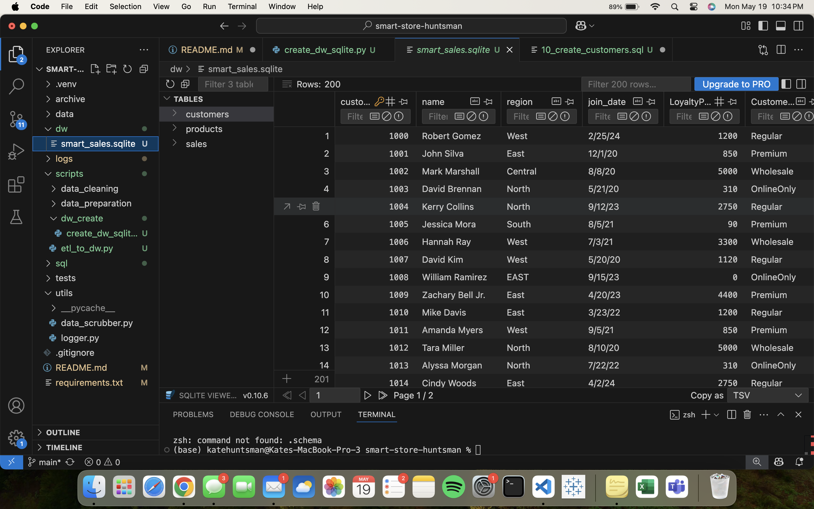
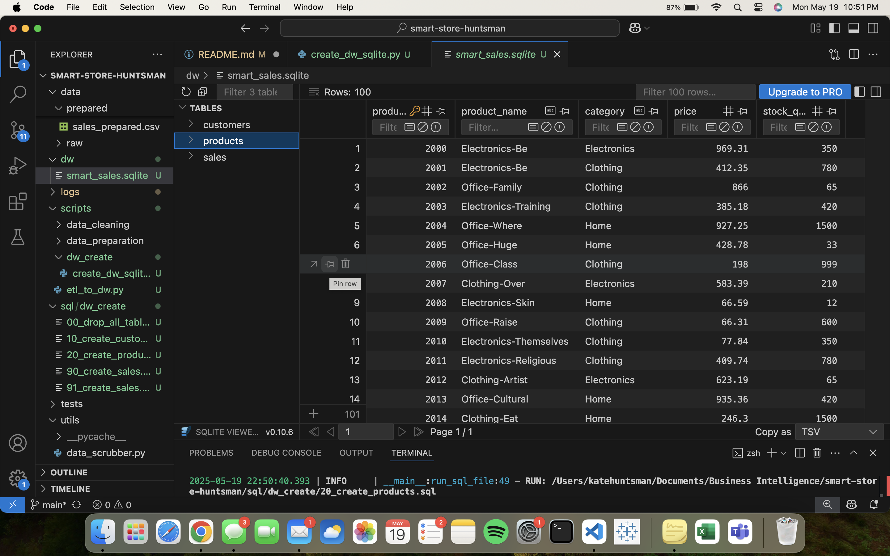
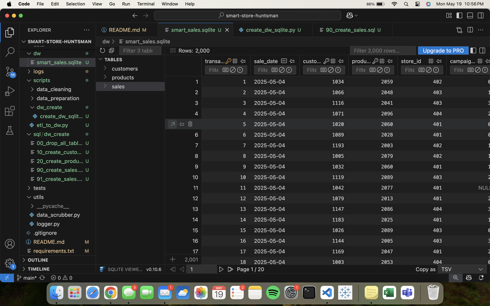

# smart-store-huntsman

## Set Up Local Environment
```
python3 -m venv .venv
source .venv/bin/activate
```

## Folder Layout
```
smart-store-huntsman/   
│
├── archive/              
│   └──data_prep.py 

├── data/                
│   ├── raw/   
       └──customers_data.csv
       └──products_data.csv
       └──sales_data.csv    

├── dw/                
│   └──smart_sales.sqlite    

├── images/                
│   └──customers_table.png            
    └──products_table.png    
    └──sales_table.png

│
├── scripts/   
    ├──data_preparation/
        └──prepare_customer.py
        └──prepare_products.py
        └──prepare_sales.py
    ├──data_cleaning/
        └──data_scrubber.py
        └──run_cleaning.py
    ├──dw_create/
        └──create_dw_sqlite.py
        └──etl_to_dw.py

├── sql/dw_create/   
    └──00_drop_all_tables.sql
    └──10_create_customers.sql
    └──20_create_products.sql
    └──90_create_sales.sql 
    └──91_create_sales.sql 

├── tests/
    └──test_data_prep.py
    └──test_data_scrubber.py
        
│
├── utils/                     
│   └── logger.py             
│
├── .gitignore                 
├── README.md                  
└── requirements.txt 
```          

## Git Add, Commit, Push to GitHub
```
git add .
git commit -m "add message"
git push
```
## Running Scripts 
### Data_Prep
```
source .venv/bin/activate
/opt/anaconda3/bin/python3 scripts/data_preparation/prepare_customers.py
/opt/anaconda3/bin/python3 scripts/data_preparation/prepare_products.py 
/opt/anaconda3/bin/python3 scripts/data_preparation/prepare_sales.py 
```

### Data_Cleaning
```
python3  -m unittest tests/test_data_scrubber.py
```

### ETL
```
python3 scripts/etl_to_dw.py
```

### SQLite
```
python3 scripts/dw_create/create_dw_sqlite.py
```

# Project 4 Details
### Design Choices
- SQLite as the Data Warehouse:
Chosen for its simplicity, portability, and ease of setup without requiring server infrastructure, making it ideal for this project’s scope.

- Schema Normalization:
The schema separates customers, products, and sales into distinct tables to reduce redundancy and improve query performance.

- Column Naming Conventions:
Adopted lowercase snake_case for all table columns to ensure consistency and compatibility with SQL best practices.

- Date Storage:
Since SQLite does not support a native DATE type, all dates are stored as TEXT in ISO format (YYYY-MM-DD) for consistent sorting and filtering.

- Data Preparation:
Raw CSV files are cleaned, normalized, and renamed to match schema column names before insertion. Duplicate rows are removed to maintain data integrity.

## Schema Implementation:
### Customers Table
| Column            | Type    | Description                |
| ----------------- | ------- | -------------------------- |
| customer\_id      | INTEGER | Primary key                |
| name              | TEXT    | Customer full name         |
| region            | TEXT    | Customer geographic region |
| join\_date        | TEXT    | Join date in ISO format    |
| loyalty\_points   | INTEGER | Loyalty points accumulated |
| customer\_segment | TEXT    | Customer segment/category  |

### Products Table
| Column          | Type    | Description            |
| --------------- | ------- | ---------------------- |
| product\_id     | INTEGER | Primary key            |
| product\_name   | TEXT    | Name of the product    |
| category        | TEXT    | Product category       |
| price           | REAL    | Price per unit         |
| stock\_quantity | INTEGER | Current stock quantity |

### Sales Table
| Column        | Type    | Description                       |
| ------------- | ------- | --------------------------------- |
| sale\_id      | INTEGER | Primary key                       |
| sale\_date    | TEXT    | Date of sale (ISO format)         |
| customer\_id  | INTEGER | Foreign key to customers          |
| product\_id   | INTEGER | Foreign key to products           |
| store\_id     | INTEGER | Store identifier                  |
| campaign\_id  | INTEGER | Marketing campaign identifier     |
| quantity      | INTEGER | Quantity sold                     |
| total\_amount | REAL    | Total sale amount after discounts |

## Screenshots
### Customers Table Sample Data


### Products Table Sample Data


### Sales Table Sample Data

