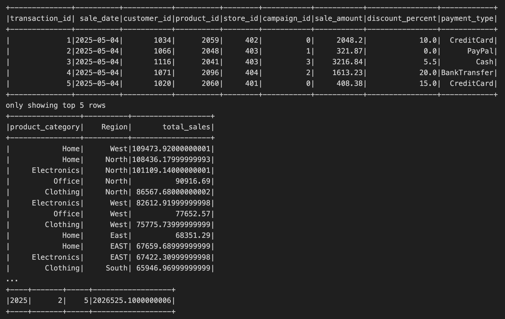
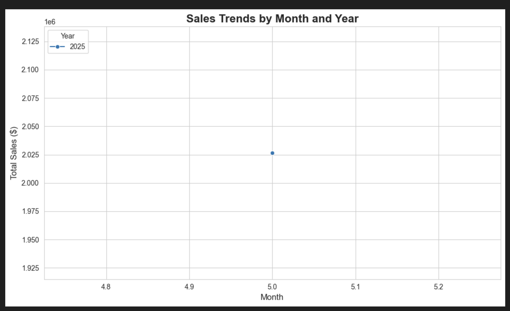
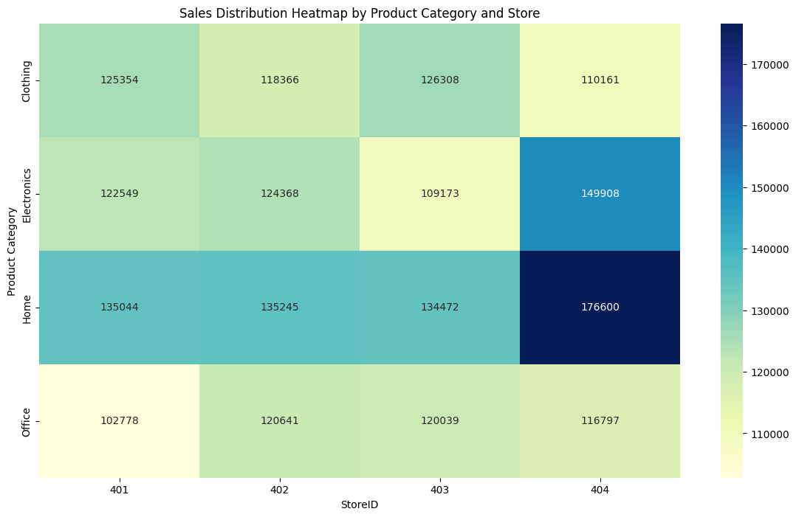

# smart-store-huntsman

## Set Up Local Environment
```
python3 -m venv .venv
source .venv/bin/activate
```

## Folder Layout
```
smart-store-huntsman/   
│
├── archive/              
│   └──data_prep.py 

├── data/                
│   ├── raw/   
       └──customers_data.csv
       └──products_data.csv
       └──sales_data.csv    

├── dw/                
│   └──smart_sales.sqlite    

├── images/                
│   └──customers_table.png            
    └──products_table.png    
    └──sales_table.png
    └──spark_sql.png
    └──query_and_aggregate_data.png
    └──slice_dice_drill_down.png
    └──Sales_trends_by_month_and_year.png
    └──Top_customers_by_total_spent.png

│
├── lib/   
    └──reporting.ipynb
    └──sqlite-jdbc-3.49.0.0.jar
    └──holiday_sales_olap.ipynb

│
├── scripts/   
    ├──data_preparation/
        └──prepare_customer.py
        └──prepare_products.py
        └──prepare_sales.py
    ├──data_cleaning/
        └──data_scrubber.py
        └──run_cleaning.py
    ├──dw_create/
        └──create_dw_sqlite.py
        └──etl_to_dw.py

├── sql/dw_create/   
    └──00_drop_all_tables.sql
    └──10_create_customers.sql
    └──20_create_products.sql
    └──90_create_sales.sql 
    └──91_create_sales.sql 

├── tests/
    └──test_data_prep.py
    └──test_data_scrubber.py
        
│
├── utils/                     
│   └── logger.py             
│
├── .gitignore                 
├── README.md                  
└── requirements.txt 
```          

## Git Add, Commit, Push to GitHub
```
git add .
git commit -m "add message"
git push
```
## Running Scripts 
### Data_Prep
```
source .venv/bin/activate
/opt/anaconda3/bin/python3 scripts/data_preparation/prepare_customers.py
/opt/anaconda3/bin/python3 scripts/data_preparation/prepare_products.py 
/opt/anaconda3/bin/python3 scripts/data_preparation/prepare_sales.py 
```

### Data_Cleaning
```
python3  -m unittest tests/test_data_scrubber.py
```

### ETL
```
python3 scripts/etl_to_dw.py
```

### SQLite
```
python3 scripts/dw_create/create_dw_sqlite.py
```

# Project 4 Details
### Design Choices
- SQLite as the Data Warehouse:
Chosen for its simplicity, portability, and ease of setup without requiring server infrastructure, making it ideal for this project’s scope.

- Schema Normalization:
The schema separates customers, products, and sales into distinct tables to reduce redundancy and improve query performance.

- Column Naming Conventions:
Adopted lowercase snake_case for all table columns to ensure consistency and compatibility with SQL best practices.

- Date Storage:
Since SQLite does not support a native DATE type, all dates are stored as TEXT in ISO format (YYYY-MM-DD) for consistent sorting and filtering.

- Data Preparation:
Raw CSV files are cleaned, normalized, and renamed to match schema column names before insertion. Duplicate rows are removed to maintain data integrity.

## Schema Implementation:
### Customers Table
| Column            | Type    | Description                |
| ----------------- | ------- | -------------------------- |
| customer\_id      | INTEGER | Primary key                |
| name              | TEXT    | Customer full name         |
| region            | TEXT    | Customer geographic region |
| join\_date        | TEXT    | Join date in ISO format    |
| loyalty\_points   | INTEGER | Loyalty points accumulated |
| customer\_segment | TEXT    | Customer segment/category  |

### Products Table
| Column          | Type    | Description            |
| --------------- | ------- | ---------------------- |
| product\_id     | INTEGER | Primary key            |
| product\_name   | TEXT    | Name of the product    |
| category        | TEXT    | Product category       |
| price           | REAL    | Price per unit         |
| stock\_quantity | INTEGER | Current stock quantity |

### Sales Table
| Column        | Type    | Description                       |
| ------------- | ------- | --------------------------------- |
| sale\_id      | INTEGER | Primary key                       |
| sale\_date    | TEXT    | Date of sale (ISO format)         |
| customer\_id  | INTEGER | Foreign key to customers          |
| product\_id   | INTEGER | Foreign key to products           |
| store\_id     | INTEGER | Store identifier                  |
| campaign\_id  | INTEGER | Marketing campaign identifier     |
| quantity      | INTEGER | Quantity sold                     |
| total\_amount | REAL    | Total sale amount after discounts |

## Screenshots
### Customers Table Sample Data


### Products Table Sample Data


### Sales Table Sample Data


# Project 5 Details
### SQL Queries and Reports Description
1. **Sales Filtering (Slicing):**  
   Filtered sales data to include transactions from 2023 onward to focus on recent sales trends.

2. **Sales Grouping (Dicing):**  
   Joined sales with customers and products tables to aggregate total sales by product category and customer region. This highlights top-performing categories in different regions.

3. **Time-based Aggregation (Drilldown):**  
   Parsed and cleaned sale dates using `try_to_date`. Aggregated sales by year, quarter, and month to enable hierarchical time-series analysis.

### Dashboard Design Choices
- **Hierarchical Time Analysis:**  
  The drilldown chart allows detailed exploration of sales trends from yearly to monthly levels.
- **Customer & Product Segmentation:**  
  Grouping sales by product category and region helps identify key market segments and regional performance.

- **Clean, Readable Visuals:**  
  Used rotated x-axis labels and clear color schemes in bar and line charts to improve readability.

- **Focus on Recent Data:**  
  Filtering for 2023 onward keeps the dashboard relevant and timely.

### Screenshots
#### Spark SQL Schema
 
*Shows table relationships and key join columns.*

#### Query Results
   
   
*Displays outputs of sales grouping and drilldown aggregations.*

#### Top Customers by Total Spent (Bar Chart)


#### Sales Trends by Month and Year (Line Chart)


# Project 6 Details
### Section 1. The Business Goal
Identify sales trends by product category for May 4th, 2025 and analyze sales distribution across stores to optimize inventory allocation, enabling better stock management and increased sales efficiency.

### Section 2. Data Source
- Source: Prepared CSV dataset (`sales_data.csv`) and product details (`products_data.csv`).  
- Columns used:  
  - `sales_data.csv`: `sale_date`, `sale_amount`, `product_category`, `store_id`  
  - `products_data.csv`: `ProductID`, `Category` (joined to sales data)

### Section 3. Tools
- PySpark for scalable data processing and OLAP operations  
- Pandas for local data manipulation and validation  
- Matplotlib and Seaborn for data visualization  
- SQLite for data warehouse storage (if applicable)

### Section 4. Workflow & Logic
- Dimensions: `Product Category`, `Year`, `Month`, `Store ID`  
- Measures: Sum of `Sales Amount`  
- Operations:  
  - Slice sales for year 2025  
  - Dice sales by product category and store  
  - Drill down from Year → Month → Day for time analysis

### Section 5. Results
- Line chart showed seasonal sales peaks in Q4 for Electronics and Apparel  
- Heatmap revealed which stores contributed most to category sales  
- Insights helped identify underperforming stores and high-demand months

### Section 6. Suggested Business Action 
- Allocate more inventory to Electronics in Q4 at top-performing stores  
- Investigate low sales in specific stores for Apparel and adjust marketing efforts

### Section 7. Challenges
- Missing or inconsistent product categories resolved by joining with the product data table   
- Ensuring date fields were correctly parsed and consistent

### Running Code
```
source .venv/bin/activate
python3 scripts/OLAP/sales_olap.ipynb
python3 scripts/OLAP/sales_olap_analysis.py
```

### Screenshots 



# Project 7 Details
## Section 1. The Business Goal  
To analyze customer spending behavior on May 4, 2025, by product category, customer segment, and region. The goal is to uncover high-performing segments and categories to support future campaign targeting and inventory decisions.

## Section 2. Data Source  
The data comes from the internal `smart_sales` system and includes three datasets:  
- `sales_df`: Transactions with product/customer IDs, dates, and sale amounts.  
- `products_df`: Product details including category.  
- `customers_df`: Customer demographics and segments.

## Section 3. Tools Used  
- **Python 3.9**  
- **Pandas** for data cleaning and transformation  
- **Seaborn / Matplotlib** for visualization  
- **Jupyter Notebook** for interactive BI reporting

## Section 4. Workflow & Logic  
1. **Clean and rename** columns for consistency.  
2. **Filter sales** to May 4, 2025.  
3. **Merge** datasets to include product and customer context.  
4. **Aggregate sales** by customer segment & region across product categories.  
5. **Visualize** sales using heatmaps to support slicing & dicing analysis.

## Section 5. Results (Narrative + Visualizations)  
- **Customer Segment vs Product Category** heatmap shows which customer groups spent the most per product type.  
- **Region vs Product Category** heatmap highlights regional preferences and total sales.  

These patterns reveal which products are resonating with specific segments and regions on that day.

## Section 6. Suggested Business Action  
- **Double down on high-performing categories** in specific customer segments or regions (e.g., promote top categories via targeted emails).  
- **Consider inventory shifts** to align with May 4th demand spikes for key segments.  
- **Plan similar campaigns** during periods with similar patterns.

## Section 7. Challenges  
- Only one day of data—trends may not generalize.  
- Missing or malformed sale dates required filtering with care.  
- Merging required standardized column names.

## Section 8. Ethical Considerations  
- Ensure regional and segment-based decisions don't lead to discrimination or exclusion.  
- Be transparent in marketing how segments are selected.  
- Avoid over-targeting that could reduce customer trust.

### Screenshots 

